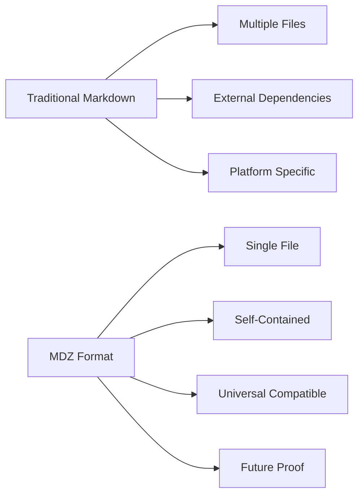

# MDZ File Format Specification - v1.1.0

*The Standard Format for Self-Contained Markdown Documents*

## 🎯 Design Philosophy

**MDZ** (Markdown Document Zip) is a revolutionary file format specifically designed to solve the fundamental challenge of **Markdown document sharing**: creating portable, self-contained documents that include all embedded media. While traditional Markdown excels at content creation, it falls short when documents need to be shared, distributed, or archived without external dependencies.

**MDZ addresses this gap by defining a standardized format that:**

- ✅ **Preserves Markdown's editing capabilities** while adding distribution strength
- ✅ **Embeds all assets** (images, videos, audio, files) directly in the document
- ✅ **Maintains universal compatibility** through the ZIP standard
- ✅ **Enables intelligent processing** of both local and network resources
- ✅ **Supports rich metadata** for document management and discoverability
- ✅ **Provides future extensibility** for advanced features while maintaining backward compatibility

## 🌟 Why MDZ is Needed

### The Markdown Sharing Problem

Traditional Markdown workflows face several critical challenges:

1. **Link Rot**: Network images break when URLs change or services go offline
2. **Asset Distribution**: Complex folder structures must be maintained alongside documents
3. **Offline Access**: Network-dependent content becomes unusable without internet
4. **Version Control**: Large binary assets bloat repositories and complicate history
5. **Platform Dependencies**: Different platforms handle asset paths differently

### The MDZ Solution

MDZ transforms Markdown from a content-authoring format into a **complete document distribution format**:



## 📋 Format Goals

MDZ is designed to be:

- **🔄 Content-Preserving**: Maintains Markdown's editability and semantics
- **📦 Self-Contained**: Includes all necessary assets within the file
- **🌐 Universal**: Works across platforms without special requirements
- **⚡ Process-Aware**: Enables intelligent asset processing and optimization
- **🔓 Open Standard**: Based on well-understood technologies (ZIP, JSON, Markdown)
- **🚀 Extensible**: Ready for future enhancements while maintaining compatibility
- **📊 Metadata-Rich**: Supports comprehensive document and asset management

---

## File Extension and MIME Type

* **File extension**: `.mdz`
* **Recommended MIME type**: `application/x-mdz`

---

## Structure of an MDZ File

An MDZ file is a **ZIP** archive with a predefined directory structure:

```
archive.mdz (ZIP archive)
├── index.md           # Main Markdown content
├── manifest.json      # Metadata and asset mapping (required)
└── assets/            # Directory for all embedded assets (optional)
    ├── images/
    │   └── image1.png
    ├── videos/
    │   └── video1.mp4
    ├── audio/
    │   └── audio1.mp3
    └── files/
        └── document.pdf
```

### Required Components

| File            | Description                                       |
| --------------- | ------------------------------------------------- |
| `index.md`      | The primary Markdown document (UTF-8 encoded)     |
| `manifest.json` | JSON metadata describing assets and configuration |

### Optional Components

| Directory  | Description                                      |
| ---------- | ------------------------------------------------ |
| `assets/`  | Contains all embedded assets organized by type   |
- `assets/images/` - Image files (PNG, JPG, SVG, etc.)
- `assets/videos/` - Video files (MP4, WebM, etc.)
- `assets/audio/` - Audio files (MP3, WAV, etc.)
- `assets/files/` - Other file attachments (PDFs, docs, etc.) |

---

## manifest.json Schema

```json
{
  "version": "1.1.0",
  "title": "Document Title",
  "author": null,
  "date": "2025-12-13",
  "filename": "document.md",
  "assets": [
    {
      "id": "img1",
      "path": "assets/images/image1.png",
      "type": "image",
      "alt": "An example image"
    },
    {
      "id": "97f524af-9d6d-4b22-8e3e-838c7ae15733",
      "path": "assets/images/97f524af-9d6d-4b22-8e3e-838c7ae15733.png",
      "type": "image",
      "alt": "Downloaded network image"
    },
    {
      "id": "vid1",
      "path": "assets/videos/video1.mp4",
      "type": "video",
      "title": "Intro Video"
    }
  ]
}
```

### Field Definitions

| Field      | Type    | Required | Description                                         |
| ---------- | ------- | -------- | --------------------------------------------------- |
| `version`  | string  | yes      | Specification version for compatibility             |
| `title`    | string  | yes      | Title of the document (defaults to filename)        |
| `author`   | string  | no       | Name of the document author                         |
| `date`     | string  | no       | Publication or creation date (ISO 8601 recommended) |
| `filename` | string  | no       | Original filename of the markdown document (v1.1.0+) |
| `assets`   | array   | no       | List of embedded assets                             |

**Note**: The `filename` field is optional since v1.1.0 for backward compatibility.

#### Asset Object Fields

| Field   | Type   | Required | Description                                            |
| ------- | ------ | -------- | ------------------------------------------------------ |
| `id`    | string | yes      | Unique identifier used for reference in index.md       |
| `path`  | string | yes      | Relative path to the asset file within the archive     |
| `type`  | string | yes      | Type of asset: `image`, `video`, `audio`, `file`, etc. |
| `alt`   | string | no       | Alternative text (for images)                          |
| `title` | string | no       | Title or caption                                       |

---

## Referencing Assets in index.md

To reference an asset within the Markdown content, use relative paths from the index.md file:

```
./assets/<category>/<filename>
```

**Example usage:**

```markdown


[Watch Intro Video](./assets/videos/vid1.mp4)
```

The relative paths ensure that the document remains viewable when the MDZ file is manually extracted and renamed to ZIP. Assets are organized by type in the assets directory.

### JSON Schema

A machine-readable [JSON Schema](https://json-schema.org/) (draft 2020-12)
for version 1.x manifests is available at
[`schemas/manifest-1.schema.json`](schemas/manifest-1.schema.json).
Producers SHOULD validate the manifest they write against it; consumers MAY
use it to reject malformed packages. The schema allows unknown properties,
in line with the compatibility rules below.

### Path safety

Asset `path` values and relative links in `index.md` MUST be relative to the
archive root: they MUST NOT start with `/`, contain a backslash (`\`) or a
`..` segment. Consumers MUST NOT resolve paths that violate these rules
(protection against "zip-slip" path traversal when extracting).

---

## Compression Method

* Compression: **DEFLATE** (ZIP default)
* Encoding: All text files (index.md, manifest.json) MUST be UTF-8 encoded

---

## Versioning

* The `manifest.json` includes a `version` field corresponding to the MDZ specification version.
* Future versions MAY introduce new fields but MUST maintain backward compatibility for core fields.

### Version History

#### v1.1.0 (Current) - 2024-12-13
- **Added**: Backward compatibility for legacy MDZ files
- **Changed**: `filename` field in manifest.json is now optional for compatibility
- **Improved**: Asset handling with relative paths for better ZIP extraction compatibility
- **Fixed**: Handling of MDZ files created with v1.0.0 that lack `filename` field

#### v1.0.0 - 2024-12-11
- **Initial release**: Core MDZ format specification
- **Features**: Basic manifest.json structure, asset organization, relative links
- **Components**: index.md, manifest.json, assets/ directory structure

---

## Compatibility and Extensibility

* **Backward Compatibility**: Parsers should ignore unknown fields in `manifest.json`.
* **Forward Compatibility**: Producers SHOULD NOT remove required fields in future versions.
* **Custom Extensions**: May be added using namespaced keys, e.g., `x-myapp-feature`.

---

## Future Considerations

* Support for multiple Markdown files per archive (e.g., `/documents/` directory)
* Table of contents or navigation map in manifest.json
* Digital signatures for integrity verification
* Optional encryption (using AES or other standards)
* Asset categorization and tagging system
* Nested directory support within assets folder

## 📚 Use Cases and Applications

### 🎯 **Primary Applications**

#### **1. Content Creation and Publishing**
- **Bloggers and Writers**: Create self-contained articles with embedded media
- **Technical Documentation**: Distribute manuals with screenshots and diagrams
- **Educational Materials**: Share lesson plans with embedded resources
- **Research Papers**: Bundle academic papers with charts and data

#### **2. Software Development**
- **README Distribution**: Share project documentation with screenshots
- **API Documentation**: Bundle API docs with code examples and diagrams
- **Tutorial Content**: Create step-by-step guides with embedded assets
- **Portfolio Projects**: Distribute project showcases with media

#### **3. Enterprise and Professional**
- **Reports and Proposals**: Share business documents with charts and graphics
- **Training Materials**: Distribute educational content with multimedia
- **Knowledge Base**: Archive documentation with embedded resources
- **Compliance Documentation**: Bundle regulatory documents with evidence

### 🔄 **Workflow Examples**

#### **Content Creator Workflow**
```
1. Create Markdown document with embedded images
   ↓
2. Add network images and local resources
   ↓
3. Pack with MDZ → Single .mdz file
   ↓
4. Share via email, cloud storage, or messaging
   ↓
5. Recipient can view offline with all media intact
```

#### **Developer Documentation Workflow**
```
1. Write technical documentation in Markdown
   ↓
2. Include screenshots, diagrams, and code examples
   ↓
3. Use MDZ to create distributable documentation package
   ↓
4. Include with software release or share separately
   ↓
5. Users have complete, offline-capable documentation
```

### 🌟 **Success Stories**

#### **Case Study 1: Technical Writer**
*Problem*: Had to send 50-page documentation with 30+ images to client
*Solution*: Created single MDZ file containing everything
*Result*: Client could view offline, no broken links, professional presentation

#### **Case Study 2: Blog Publisher**
*Problem*: Blog platform didn't support local image uploads efficiently
*Solution*: Used MDZ to bundle articles with all media
*Result*: Reliable article distribution, faster page loads, better reader experience

#### **Case Study 3: Software Team**
*Problem*: README files with broken screenshots after repository restructuring
*Solution*: Adopted MDZ for project documentation distribution
*Result:*
* Immovable asset references
* Smaller git repositories
* Better user onboarding experience

## 🎯 **Best Practices**

### ✅ **Content Creation**
- **Optimize Images**: Compress images before including in MDZ
- **Organize Assets**: Use logical naming conventions
- **Test Offline**: Verify content works without internet connection
- **Include Alt Text**: Ensure accessibility for embedded images

### ✅ **Distribution**
- **File Size**: Monitor MDZ file size for email/platform limits
- **Version Control**: Use MDZ for distribution, not for version control
- **Metadata**: Include meaningful title and author information
- **Compatibility**: Test with target MDZ readers/tools

### ✅ **Maintenance**
- **Regular Updates**: Re-pack when content or assets change
- **Backup Strategy**: Keep source files alongside MDZ versions
- **Link Verification**: Ensure all external links are captured during packing
- **Documentation**: Document MDZ creation process for teams

## 🔮 **Future Enhancements**

The MDZ format is designed with extensibility in mind. Planned future enhancements include:

### 📋 **Specification Evolution**
- **Multiple Documents**: Support for multi-document MDZ files
- **Advanced Metadata**: Enhanced document categorization and search
- **Security Features**: Digital signatures and encryption support
- **Interactive Elements**: Embedded forms and interactive content

### 🛠️ **Tool Integration**
- **Editor Plugins**: Enhanced support for popular Markdown editors
- **Build Tools**: Integration with static site generators
- **CMS Platforms**: Native support in content management systems
- **Cloud Services**: Direct MDZ creation and viewing services

### 📊 **Analytics and Management**
- **Usage Tracking**: Document access statistics
- **Content Indexing**: Search across multiple MDZ files
- **Version Management**: MDZ-specific versioning and diff tools
- **Automated Processing**: Server-side asset optimization and processing

## 📖 **Reference Implementation**

For developers and tool creators looking to implement MDZ support, this specification provides:

- **Complete format definition** with examples
- **Processing guidelines** for asset handling
- **Backward compatibility requirements** for format evolution
- **Implementation best practices** for tool development

---

## License

This specification is published under the MIT License.

---

## Implementation: MDZ CLI Tool

A reference implementation of the MDZ format is provided as a command-line tool with the following features:

### Pack Command

```bash
# Basic usage - output to input_file.mdz
mdz pack <input_file>

# Specify output path
mdz pack <input_file> --output <output_file>
mdz pack <input_file> -o <output_file>
```

**Features:**
- Automatically downloads network images and saves them with UUID filenames
- Copies local images to assets directory
- Updates all image references to use relative paths (`./assets/...`)
- Supports PNG, JPG, SVG, and other image formats
- Handles download failures gracefully (keeps original links)

### Unpack Command

```bash
# Unpack to MDZ file's parent directory (default)
mdz unpack <input_file>

# Unpack to specific directory
mdz unpack <input_file> --output <directory>
mdz unpack <input_file> -o <directory>
```

**Features:**
- Restores original markdown filename
- Maintains relative paths for assets
- Preserves directory structure
- Keeps all asset files accessible

### Asset Handling

**Network Images:**
- Downloaded asynchronously with UUID filenames: `{uuid}.extension`
- On download failure: original URL is preserved
- Supported protocols: HTTP, HTTPS

**Local Files:**
- Copied with original filenames + counter to avoid conflicts
- Resolved relative to markdown file location
- Supports both relative and absolute paths

**Example Transformation:**
```markdown
# Before packing:


# After packing (stored in index.md):


# After unpacking:


```

---

## Implementation: VS Code Extension

A comprehensive VS Code extension is available for seamless MDZ integration:

### Features
- **Export**: Right-click `.md` files → "Export as MDZ"
- **Unpack**: Right-click `.mdz` files → "Unpack MDZ"
- **Editor Integration**: Quick action buttons in editor title bar
- **Command Palette**: `Ctrl+Shift+P` → "MDZ: Export as MDZ"
- **Progress Tracking**: Real-time progress indicators
- **Error Handling**: Comprehensive error messages and guidance

### Installation
```sh
# From VS Code Marketplace
code --install-extension wflixu.mdz

# From VSIX
code --install-extension mdz-1.1.0.vsix
```

### Requirements
- MDZ CLI tool must be installed (`cargo install mdz`)
- VS Code 1.84.0 or higher

### Configuration
```json
{
  "mdz.cliPath": "/path/to/mdz",
  "mdz.autoShowOutput": true,
  "mdz.confirmOverwrite": true
}
```

---

**Author**: Li Xu
**Version**: v1.1.0
**Initial Release**: December 2025
**Repository**: [https://github.com/wflixu/mdz](https://github.com/wflixu/mdz)
